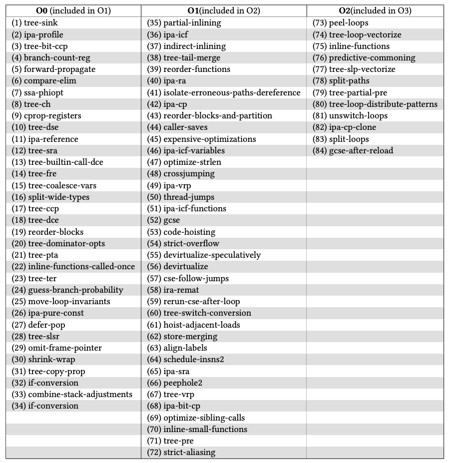
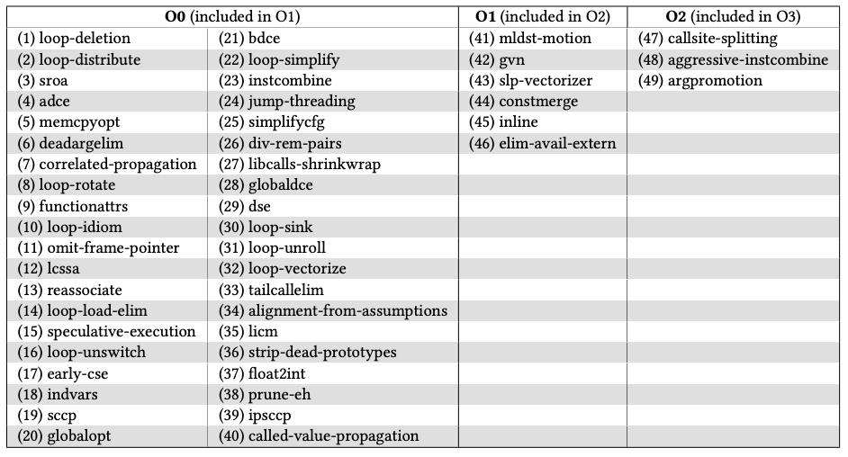

# compiler-opt-gadget-dataset
Research dataset of SPEC 2006 and real-world binaries built with different compilers and optimizations.

## Useful information
The following table contains the single optimization variants that were generated using the GCC compiler for this study.  

  

The following table contains the single optimization variants that were generated using Clang.

In both tables, the column identifier indicates the baseline optimization that the single optimization variant was compared against using GSA. Although single-optimization variants were built for all benchmark programs for our fine-grained analysis in our paper, the majority of single-optimization variants were derived from our common Linux benchmarks.
